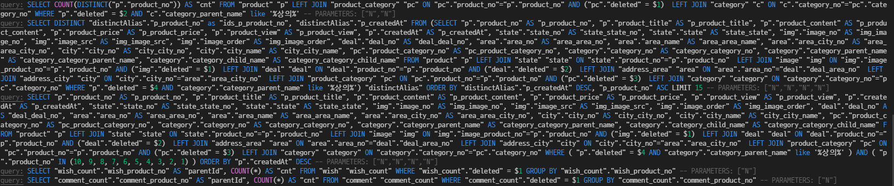

# The Second Cycle (thesecondcycle.net)

> 중고거래 플랫폼 프로젝트

# Project Structure
> Nest.js + Next.js 구조로 개발했습니다. 저는 Nest.js를 사용한 API Server와 AWS를 사용한 인프라를 담당했습니다. 프로젝트에 사용할 기술 목록을 사전에 정의했으며, 약 6개월간 해당 기술들을 학습하며 제가 겪었던 에러와 고민했던 점들을 [기술블로그](https://velog.io/@rkdden12)에 정리 해 두었습니다.

> 사용한 기술스택은 다음과 같습니다.
<br>• Node.js(v14.17.4)
<br>• Nest.js(v7 -> v8)
<br>• husky
<br>• postgresql
<br>• TypeORM (ORM)
<br>• OAuth2.0(passport) + JWT(access, refresh) (Login)
<br>• Socket.io
<br>• dotenv
<br>• AWS (Infra)
<br>• Nginx + ssl(Reverse Proxy Server)
<br>• Sentry.io (Error log)
<br>• Git Action + S3 + CodeDeploy + IAM (CI/CD)

> ERD & API는 다음과 같이 정리했습니다. <br> • ErdCloud: https://www.erdcloud.com/d/kqfMXxrKuqQdFxsjL <br> • SWAGGER: https://thesecondcycle.net/api/

🔑 프로젝트에서는 API Server / Infra / 기획 / 설계 / 일정관리 등을 담당했습니다.

# Nest.js (API Server)
> Next.js에서 요청한 데이터를 JSON으로 response 한다. 구조는 다음과 같습니다.
* auth : passport를 사용한 jwt guard와 strategy 파일을 관리합니다.
* chat: 채팅 관련 파일을 관리합니다 (개발중)
* common: 정적인 라우터를 관리합니다.
* entity: db의 모든 테이블을 관리합니다.
* middlewares: 로깅하는 미들웨어들을 관리합니다.
* product: 상품관련 파일들을 관리합니다.
  * dto: 상품 관련 dto를 관리합니다.
  * query: 상품 관련 쿼리를 작성합니다.
* user: 유저관련 파일들을 관리합니다.
  * dto: 유저 관련 dto를 관리합니다.
  * query: 유저 관련 쿼리를 작성합니다.
* app: 모든 모듈을 합쳐 main.ts로 넘기는 역할을 합니다.
🔑 비지니스 로직은 service와 controller에서 했으며 query 파일에 쿼리를 따로 빼서 작성했습니다.

# husky
> 허스키를 적용하여 commit과 push에 정책을 적용했습니다.

* pre-commit: npm run precommit
  * 모든 ts파일에 아래 명령어를 적용한 후 통과하면 커밋합니다.
    ```
      "npm run lint",
      "npm run format",
      "npm run lint:fix"
    ```
* pre-push: npm run check-types
  * tsc --noEmit 명령어를 실행하여 컴파일이 완료가 된 경우만 푸시합니다.

# TypeORM (ORM)
> ui중심으로 서버를 설계하며 모든 라우터에 맞는 쿼리를 따로 작성했습니다.
* 대부분의 query는 querybuilder를 통해 직접 쿼리를 작성했습니다.
* 한 쿼리가 너무 긴것 같은 경우나 TypeORM 이슈가 있는 경우 서브쿼리를 사용했습니다.

🔑 모든 쿼리를 직접 확인하고 실행해보며 오류를 찾았습니다.



# OAuth2.0 + JWT (Login)
> passport 패키지를 사용해 페이스북/카카오톡 로그인을 구현하고 불필요한 회원가입 프로세스를 제거했습니다. 또한, JWT Token을  자체적으로 구현해서 bearer Authorizaton 을 기반으로 인증 시스템을 구현하며. accessToken과 refreshToken을 구현했습니다.

* [소셜로그인구현](https://velog.io/@rkdden12/Nest.js-%EC%86%8C%EC%85%9C%EB%A1%9C%EA%B7%B8%EC%9D%B8)

🔑 회원의 아이디만 토큰에 담으며, token 유출에 따른 보안 문제를 최소화했습니다.

# Socket.io
> 개발중

# dotenv
> dotenv를 사용하여 환경 변수를 관리했습니다.

* .env 파일로 운영서버, 개발서버, 로컬서버 정보를 따로 관리했습니다.
* .env 파일로 노출되면 안되는 환경 변수를 숨겼습니다.

🔑 dotenv 예시
```
SECRET=test
COOKIE_SECRET=test
SERVICE_PORT=8000
DB_HOST=localhost
DB_USERNAME=postgres
DB_PASSWORD=test
DB_DATABASE=test
DB_PORT=5000
JWT_SECRET=test
KAKAO_KEY=test
KAKAO_CALLBACK_URL=http://localhost:8000/api/v2/user/auth/kakao/callback
FACEBOOK_CLIENT_ID=test
FACEBOOK_CLIENT_SECRET=test
FACEBOOK_CALLBACK_URL=http://localhost:8000/api/v2/user/auth/facebook/callback
AES_KEY=test
CLIENT_URL=https://thesecondcycle.net
```

# AWS (Infra)
> 전체 프로젝트 인프라 구성 및 IAM계정 별 권한을 관리한다.

🔑 프로젝트 완료후 EC2의 ssh 접근권한은 본인의 IP 만 허용했습니다. 또한, Git Action의 IAM 계정 및 권한을 부여해 보안성을 강화했습니다.

# Sentry.io (Error log)
> 에러 로그 수집을 위해 Sentry를 사용해 에러가 일어나면 로그를 분석하고 해결하였습니다.


# Nginx + ssl (Reverse Proxy Server)
> lets encrypt를 사용하여 ssl을 적용하며, Nginx를 사용해 클라이언트로부터 전달받은 요청을 어플리케이션 서버에 전달한 뒤, 어플리케이션 서버가 반환한 결과값을 다시 클라이언트에게 전달했습니다.

* ssl을 적용하여 자동 갱신이 되게 적용했습니다.
* nginx를 사용하여 프록시 서버를 적용했습니다.
* 80포트로 요청이 오면 443포트로 redirect 시켰습니다.
* 443포트 요청시 url에 /api가 붙어있으면 리버스 프록시를 적용하여 서비스 포트로 요청을 보낸후 처리했습니다.

🔑 https://velog.io/@rkdden12/Nestjsnginxssl

# Git Action + S3 + CodeDeploy + IAM (CI/CD)
> Git Action과 AWS의 S3, CodeDeploy를 통해 CI/CD를 구현한다.

🔑 https://velog.io/@rkdden12/AWS-EC2%EC%97%90%EC%84%9C-%ED%94%84%EB%A1%9C%EC%A0%9D%ED%8A%B8-%EB%B0%B0%ED%8F%AC%ED%95%98%EA%B8%B0-4